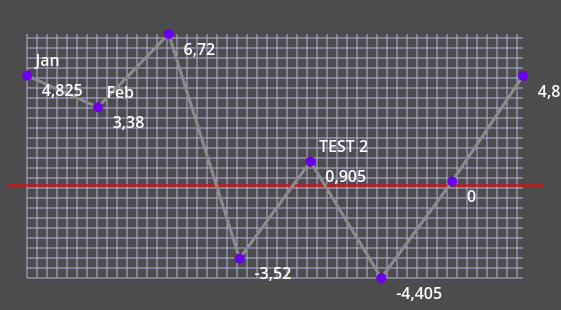
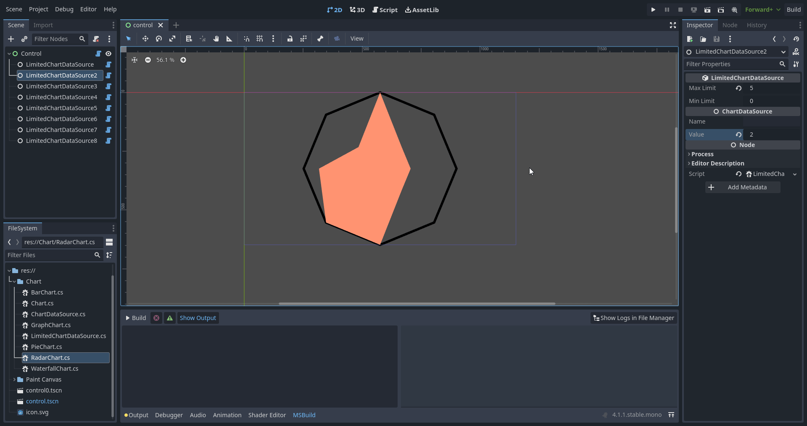

# Godot-Chart-Implementation
Experimentelles Kartensystem

## Verwendung
1. Herunterlanden Sie Godot 4+ bei .Net 
2. Erfassen Sie das Projekt.  
3. Fügen Sie ein Karte und eine Kartedataquelle als Kind zur Karte.  
4. Einstellungen Sie nach Belieben anpassen!  

## Kartetypen
**Graphikkarte:**  
  

**Kreisdiagramm:**  
  

**Wasserfallkarte:**  

**Balkendiagramm**  

**Radardiagramm**  

## Knotenfreie Diagramme

Wollen Sie nicht Knoten verwenden zu Daten mani manipulieren ? Kein Problem! Sie können knotenfreie Diagramme verwenden auch!  
Hinweis : Radardiagramm ist nicht unterstützt!

