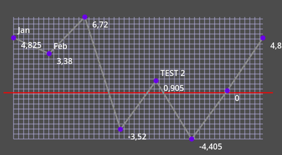
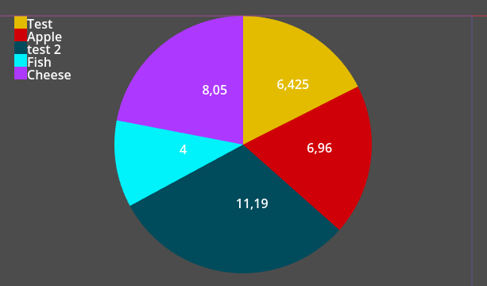
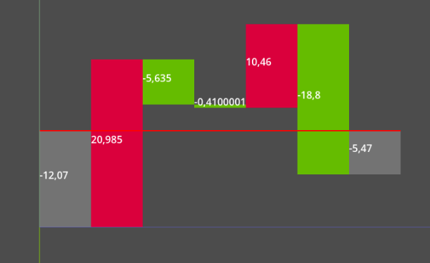
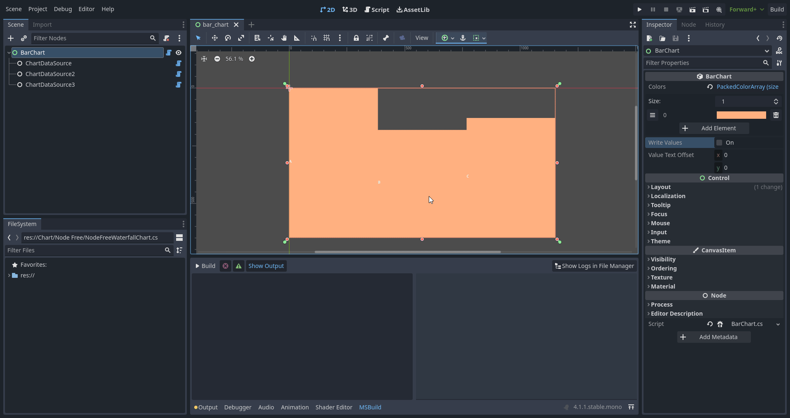
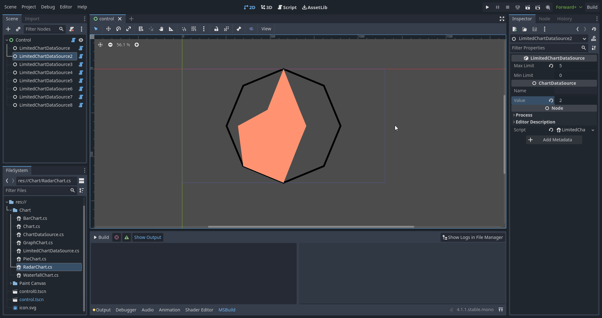
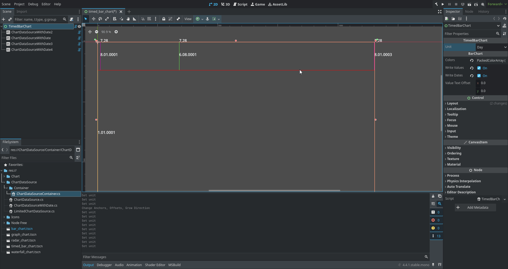
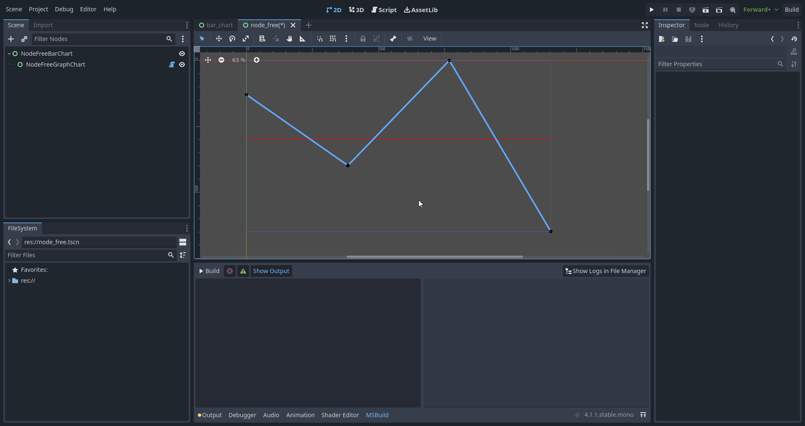

# Godot-Chart-Implementation
Deneysel çizelge sistemi.

## Kullanım
1. .Net ile Godot 4+ indirin. 
2. Projeyi derleyin.  
3. Çizelgeyi ve çizelgeye çocuğu olarak çizelge veri kaynağını ekleyin.  
4. İstediğiniz kadar ayarlar ile oynayın!  

## Çizelge Türleri
**Graf Çizelgesi:**  
  

**Pasta Çizelgesi:**  
  

**Şelale Çizelgesi:**  

**Bar Çizelgesi**  

**Radar Çizelgesi**  

**Zamanlanmış Bar Çizelgesi**  
Not : Yalnızca zamanlanmış çizelge verisiyle çalışır.

## Düğümsüz Çizelgeler

Verileri manipüle etmek için düğüm kullanmak istemiyor musunuz ? Sorun değil! Düğümsüz çizlgeleri de kullanabilrisiniz!  
Not : Radar Çizelgesi desteklememektedir!

